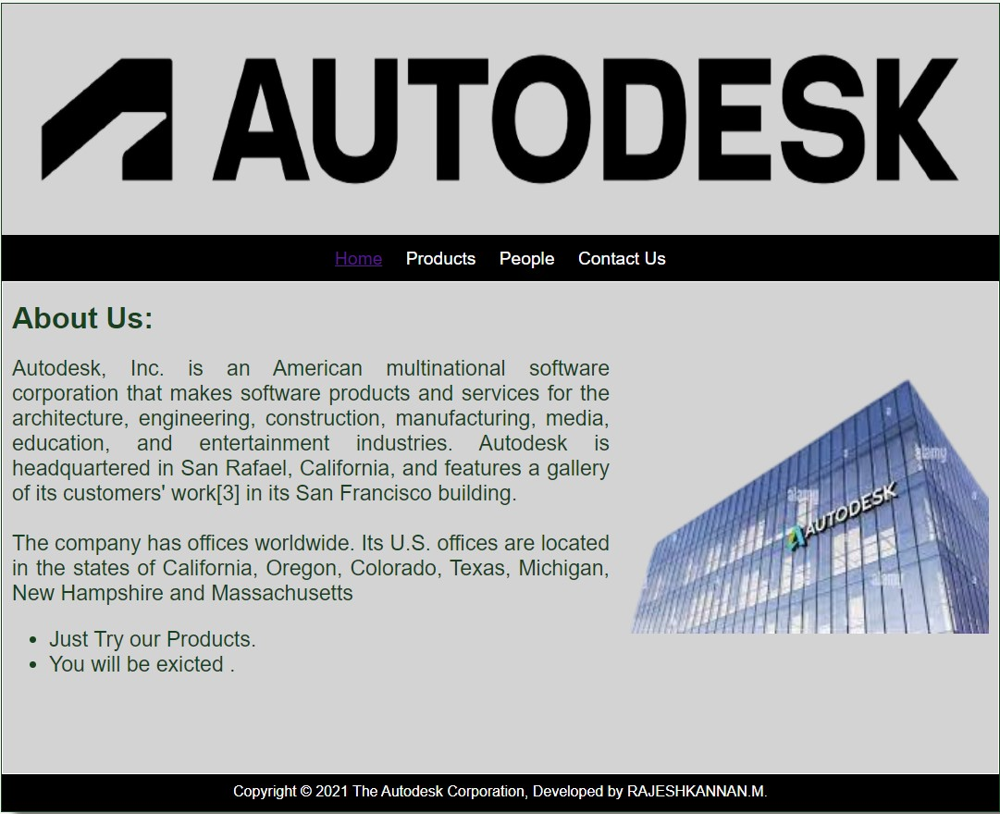
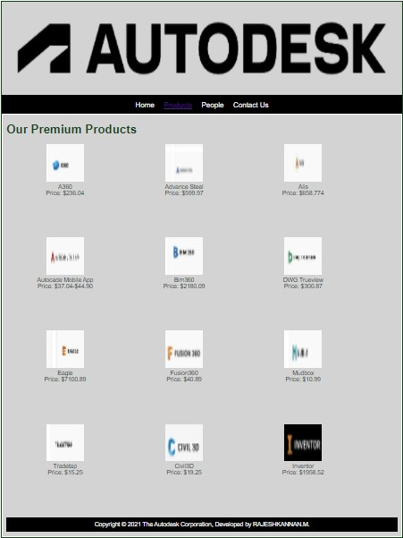
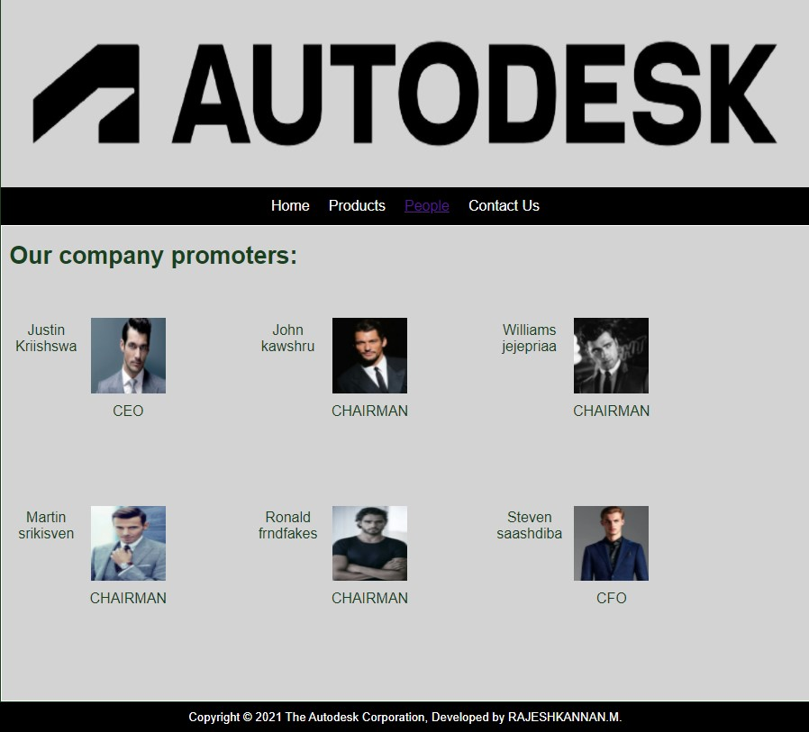
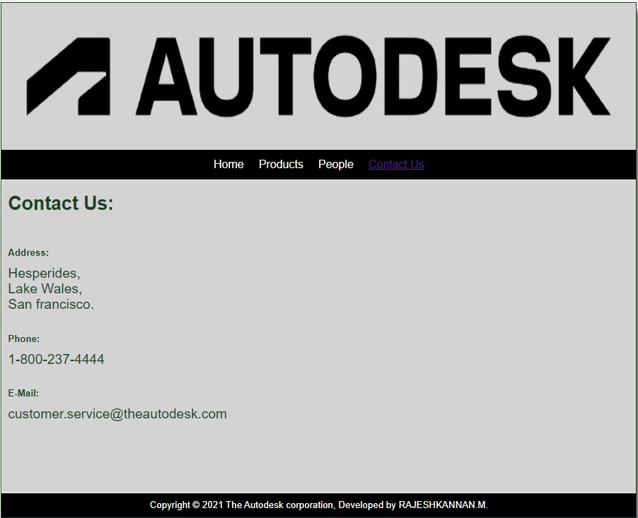

# Web Design for a Software Product Company

## AIM:

To design a static website for a software product company company.

## DESIGN STEPS:

### Step 1:

Requirement collection.

### Step 2:

Creating the layout using HTML and CSS.

### Step 3:

Updating the sample content.

### Step 4:

Choose the appropriate style and color scheme.

### Step 5:

Validate the layout in various browsers.

### Step 6:

Validate the HTML code.

### Step 6:

Publish the website in the given URL.

## PROGRAM :
layout.css
```
* {
  box-sizing: border-box;
  font-family: Arial, Helvetica, sans-serif;
}
body {
  background-color: whitesmoke;
  color: #17421d;
}
.container {
  width: 1080px;
  margin-left: auto;
  margin-right: auto;
  border-width: 1px 1px 1px 1px;
  border-style: solid;
  box-shadow: 15px 15px 8px gray;
}

.banner {
  display: block;
  width: 100%;
  height: 250px;
  text-align: center;
  font-size: 60px;
  background-image: url("/static/img/auto1.png");
  background-size: 100% 100%;
  background-color: #D3D3D3;
  margin: 0px 0px 0px 0px;
  padding-top: 150px;
  color: #16d1ae;
}

.menu {
  display: block;
  width: 100%;
  height: 50px;
  font-size: larger;
  background-color: black;
  text-align: center;
  padding-top: 15px;
  margin: 0px 0px 0px 0px;
  border-width: 1px;
}

.menuitem {
  display: inline-block;
  margin-left: 10px;
  margin-right: 10px;
}
.menuitemselected {
  display: inline-block;
  margin-left: 10px;
  margin-right: 10px;
  color: #16d1ae;
}

.menuitem a {
  text-decoration: none;
  color: white;
}

.content {
  display: block;
  width: 100%;
  background-color: #D3D3D3;
  min-height: 500px;
  margin: 0px 0px 0px 0px;
  border-width: 1px;
  border-color: white;
  border-style: solid;
}
.homecontent {
  min-height: 500px;
  margin: 10px 10px 10px 10px;
  font-size: larger;
  
}
.homecontent h1 {
  text-align: left;
  font-size: xx-large;
}
.homecontent h2 {
  text-align: left;
  font-size: medium;
}
.homecontent img {
  float: right;
  width: 400px;
  height: 300px;
  margin-left: 10px;
}

.contenttext {
  text-align: justify;
  font-size: larger;
}

.productcontent {
  min-height: 500px;
  margin: 10px 10px 10px 10px;
}

.productcontent h1 {
  text-align: left;

}

.productitems {
  display: block;
}

.productitem {
  display: inline-block;
  width: 30%;
  height: 250px;
  text-align: center;
}

.productitem img {
  width: 100px;
  height: 100px;
  display: block;
}
.productitem .itemimage {
  display: block;
  margin-left: auto;
  margin-right: auto;
  width: 100px;
  margin-bottom: 5px;
}

.productitem .itemname {
  display: block;
}
.productitem .itemprice {
  display: block;
}

.footer {
  display: block;
  width: 100%;
  height: 40px;
  background-color: #000000;
  text-align: center;
  padding-top: 10px;
  margin: 0px 0px 0px 0px;
  color: white;
}


```
Home Page
```
<!DOCTYPE html>
<html lang="en">
  <head>
    <title>Autodesk</title>
    <link rel="stylesheet" href="./css/layout.css" />
    <link rel="icon" href="./img/icon.png" type="image/x-icon" />
  </head>

  <body>
    <div class="container">
      <div class="banner"></div>
      <div class="menu">
        <div class="menuitemselected"><a href="/static/home.html">Home</a></div>
        <div class="menuitem"><a href="/static/products.html">Products</a></div>
        <div class="menuitem"><a href="/static/people.html">People</a></div>
        <div class="menuitem"><a href="/static/contactus.html">Contact Us</a></div>
      </div>
      <div class="content">
        <div class="homecontent">
          <h1>About Us:</h1>
          
          <div class="contenttext">
            Autodesk, Inc. is an American multinational software corporation that makes software products and services for 
            the architecture, engineering, construction, manufacturing, media, education, and entertainment industries. 
            Autodesk is headquartered in San Rafael, California, and features a gallery of its customers' work[3] in its
             San Francisco building. 
            <br />
            <br/>
            
            The company has offices worldwide. Its U.S. offices are located in the states of California, Oregon, Colorado,
             Texas, Michigan, New Hampshire and Massachusetts
            <ul>
              <li>Just Try our Products.</li>
              <li>You will be exicted .</li>
            </ul>
          </div>
        </div>
      </div>
      <div class="footer">
        Copyright &#169; 2021 The Autodesk Corporation, Developed by RAJESHKANNAN.M.
      </div>
    </div>
  </body>
</html>

```
Products Page
```
<!DOCTYPE html>
<html lang="en">
  <head>
    <title>Autodesk</title>
    <link rel="stylesheet" href="./css/layout.css" />
    <link rel="icon" href="./img/icon.png" type="image/x-icon" />
  </head>

  <body>
    <div class="container">
      <div class="banner"></div>
      <div class="menu">
        <div class="menuitem"><a href="/static/home.html">Home</a></div>
        <div class="menuitemselected"><a href="/static/products.html">Products</a></div>
        <div class="menuitem"><a href="/static/people.html">People</a></div>
        <div class="menuitem"><a href="/static/contactus.html">Contact Us</a></div>
      </div>
      <div class="content">
        <div class="productcontent">    
          <h1>Our Premium Products</h1>
          <div class="productitems">
              <div class="productitem"> 
                  <div class="itemimage">
                  
                  </div>
                  <div class="itemname">A360</div>
                  <div class="itemprice">Price: $236.04 </div>
              </div>
              <div class="productitem"> 
                  <div class="itemimage">
                  
                  </div>
                  <div class="itemname">Advance Steel </div>
                  <div class="itemprice">Price: $599.97</div>
              </div>
              <div class="productitem"> 
                <div class="itemimage">
                
                </div>
                <div class="itemname">Alis</div>
                <div class="itemprice">Price: $658.774 </div>
            </div>
            <div class="productitem"> 
              <div class="itemimage">
              
              </div>
              <div class="itemname">Autocade Mobile App</div>
              <div class="itemprice">Price: $37.04-$44.90</div>
          </div>
          <div class="productitem"> 
            <div class="itemimage">
            
            </div>
            <div class="itemname">Bim360</div>
            <div class="itemprice">Price: $2180.09 </div>
        </div>
        <div class="productitem"> 
          <div class="itemimage">
          
          </div>
          <div class="itemname">DWG Trueview</div>
          <div class="itemprice">Price: $300.87 </div>
          </div>
          <div class="productitem"> 
            <div class="itemimage">
            
            </div>
            <div class="itemname">Eagle</div>
            <div class="itemprice">Price: $7100.89 </div>
            </div>
            <div class="productitem"> 
              <div class="itemimage">
              
              </div>
              <div class="itemname">Fusion360</div>
              <div class="itemprice">Price: $40.89 </div>
          </div>
          <div class="productitem"> 
            <div class="itemimage">
            
            </div>
            <div class="itemname">Mudbox</div>
            <div class="itemprice">Price: $10.99 </div>
            </div>    
            <div class="productitem"> 
              <div class="itemimage">
              
              </div>
              <div class="itemname">Tradetap</div>
              <div class="itemprice">Price: $15.25</div>
              </div>    
              <div class="productitem"> 
                <div class="itemimage">
                
                </div>
                <div class="itemname">Civil3D</div>
                <div class="itemprice">Price: $19.25</div>
                </div>
                <div class="productitem"> 
                  <div class="itemimage">
                  
                  </div>
                  <div class="itemname">Inventor</div>
                  <div class="itemprice">Price: $1958.52</div>
                  </div>
      </div>
      <div class="footer">
        Copyright &#169; 2021 The Autodesk Corporation, Developed by RAJESHKANNAN.M.
      </div>
    </div>
  </body>
</html>

```
People Page
```
<!DOCTYPE html>
<html lang="en">
  <head>
    <title>Autodesk</title>
    <link rel="stylesheet" href="./css/layout.css" />
    <link rel="icon" href="./img/ail.png" type="image/x-icon" />
    </head>
    <body>
    <div class="container">
      <div class="banner"></div>
      <div class="menu">
        <div class="menuitem"><a href="/static/home.html">Home</a></div>
        <div class="menuitem"><a href="/static/products.html">Products</a></div>
        <div class="menuitemselected"><a href="/static/people.html">People</a></div>
        <div class="menuitem"><a href="/static/contactus.html">Contact Us</a></div>
        </div>
      <div class="content">
        <div class="homecontent">
          <h1>Our company promoters:</h1><br><br>
          <div class="productitems">
            <div class="productitem"> 
                <div class="itemimage">
                
                </div>
                <div class="itemname"> Justin Kriishswa </div><br><br><br>
                <div class="itemprice">   CEO  </div>
            </div>
            <div class="productitem"> 
                <div class="itemimage">
                
                </div>
                <div class="itemname"> John kawshru </div><br><br><br>
                <div class="itemprice">CHAIRMAN</div>
            </div>
            <div class="productitem"> 
              <div class="itemimage">
              
              </div>
              <div class="itemname">Williams jejepriaa</div><br><br><br>
              <div class="itemprice">CHAIRMAN</div>
            </div>
            <div class="productitem"> 
              <div class="itemimage">
              
              </div>
              <div class="itemname">Martin srikisven</div><br><br><br>
              <div class="itemprice">CHAIRMAN</div>
          </div>
          <div class="productitem"> 
            <div class="itemimage">
            
            </div>
            <div class="itemname">Ronald frndfakes</div><br><br><br>
            <div class="itemprice">CHAIRMAN </div>
        </div>  <div class="productitem"> 
          <div class="itemimage">
          
          </div>
          <div class="itemname">Steven saashdiba </div><br><br><br>
          <div class="itemprice">  CFO  </div>
      </div>
          </div>
        </div>
        </div>        
    </div>
    <div class="footer">
      Copyright &#169; 2021 The Autodesk Corporation, Developed by RAJESHKANNAN.M.
    </div>
  </div>
</body>
</html>
```
Contact Us Page
```
<!DOCTYPE html>
<html lang="en">
  <head>
    <title>Autodesk</title>
    <link rel="stylesheet" href="./css/layout.css" />
    <link rel="icon" href="./img/ail.png" type="image/x-icon" />
  </head>

  <body>
    <div class="container">
      <div class="banner"></div>
      <div class="menu">
        <div class="menuitem"><a href="/static/home.html">Home</a></div>
        <div class="menuitem"><a href="/static/products.html">Products</a></div>
        <div class="menuitem"><a href="/static/people.html">People</a></div>
        <div class="menuitemselected"><a href="/static/contactus.html">Contact Us</a></div>
      </div>
      <div class="content">
        <div class="homecontent">
          <h1>Contact Us:</h1><br>
          <h2>Address:</h2>
          <div class="contenttext">
           Hesperides,
           <br>Lake Wales,
           <br>San francisco.
          </div><br>
          <h2>Phone:</h2>
          <div class="contenttext">
            1-800-237-4444
          </div><br>
          <h2>E-Mail:</h2>
          <div class="contenttext">
           customer.service@theautodesk.com
          </div>
        </div>
      </div>
      <div class="footer">
        Copyright &#169; 2021  The Autodesk corporation, Developed by RAJESHKANNAN.M.
      </div>
    </div>
  </body>
</html>
```
## OUTPUT:

### Home Page:



### Product Page:


### People Page:


### Contact Us Page:


## Result:

Thus a website is designed for the software product company and the HTML,CSS code are validated.
